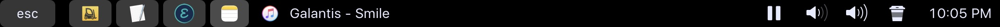

# dotfiles

This is a public copy of my dotfiles, recently updated

Original README follows.

# Better command-line tools

  * `tldr` instead of `man` 
  * `fd` to find files
  * `ag` to search file contents

(Install instructions below)

# Setting up coding environment on new Mac

*NOTE: This guide is a work in progress.*

On macOS Terminal, new shell runs dotfiles in this order, per current setup:

	.zprofile (manually loads .profile
	.profile (manually loads .profile_local)
	.profile_local
	.zshrc
	
## Start here

Install brew: https://brew.sh

Install git with brew

## brew

See apps in **`brew_leaves.txt`**

Install with `xargs brew install < brew_leaves.txt `

Generate via `brew leaves > brew_leaves.txt`.

Additional:

	brew tap homebrew/cask-fonts                  # you only have to do this once!
	brew install font-inconsolata
	brew install --cask qlstephen
	brew install --cask stats

Utils:

	brew leaves
	brew list --pinned

### brew's git

I am using brew's git (`which -a git`) which seems to have trouble with
autocomplete (it hangs on `git add ...`, eg)

Not sure how to resolve.

# Tmux

First, install plug in manager: https://github.com/tmux-plugins/tpm

Then install tmux resurrect, etc

# Python 

Manage python with Brew

`brew pin python@3.8` to prevent automatic upgrades. See pins with `brew list --pinned`

To upgrade to 3.8.x, use `brew reinstall python@3.8`. Otherwise, `brew upgrade`
will update python to latest version (eg, 3.9). Also see pin above.

Use Python 2 kernel in Jupyter:
http://ipython.readthedocs.io/en/stable/install/kernel_install.html

Current usage:

  * use `python3` and `pip` or `pip3` command
  * without virtualenv, do NOT need (????) `--local` in pip. It installs locally,
    probably after the following:
  * I got `pip` command after `python3 -m pip install --upgrade pip`
  * Previously, there was only `pip3` and no `pip` command

Check with

	brew info python or brew info python@3.8

## Virtual envs

Use either:

  * For global/shared envs, use `virtualenvwrapper` such as
    `mkvirtualenv`. Pass python version with `-p`
  * To store at project root, use `python3 -m venv env`

Jupyter:

  * In Terminal, activate virtual env, then install ipykernel and register it (search online)
  * See: https://ipython.readthedocs.io/en/stable/install/kernel_install.html#kernels-for-different-environments
  
  
References

  * PROJECT_HOME, virtualenv projects: https://stackoverflow.com/a/9425560/3217870

## Conda

Conda is not used by default. Activate only as needed:

	source ~/miniforge3/bin/activate

This was installed into `~/miniforge3` with:

	You have chosen to not have conda modify your shell scripts at all.
	To activate conda's base environment in your current shell session:

	eval "$(/Users/paul/miniforge3/bin/conda shell.YOUR_SHELL_NAME hook)" 

... per https://developer.apple.com/metal/tensorflow-plugin 

## Tensorflow

Install(ed) per https://developer.apple.com/metal/tensorflow-plugin/

# R

R installation should install it for Terminal at `/usr/local/bin/R`

# Emacs

**Update: macOS Big Sur seems to fix the following issue**

macOS Catalina Problems: spotlight switching and desktop file access. Resolve:

1. Install from https://emacsformacosx.com
1. Then OPEN emacs for the first time, to overcome the "unsigned package" dialog and so that next steps work. Otherwise you may get a "Emacs package is corrupted" or similar error..
1. Carefully rename some files inside the package contents

  * mv the `*_10` not the `*_14` binary (on my setup)
  * See [this link](https://spin.atomicobject.com/2019/12/12/fixing-emacs-macos-catalina/)

1. Now, you can try opening desktop files. Maybe it will prompt for access. If not, go into macOS security and privacy settings per above link and add disk access for Emacs

Also, maybe related: https://docs.brew.sh/FAQ#my-mac-apps-dont-find-usrlocalbin-utilities

Start with `.emacs` (from `.emacs.lite`) then install packages from
`.emacs.d/.emacs.local` as needed.

	M-x package-install RET my_package_name

Packages to install

  * `exec-path-from-shell`
  * `flycheck`
  * `magit`
  * more in `.emacs`

Reference for package management: [https://dotfilehub.com/knoebber/emacs](https://dotfilehub.com/knoebber/emacs)
  
[Run R from SSH session](https://www.r-bloggers.com/run-a-remote-r-session-in-emacs-emacs-ess-r-ssh/)

## Elpy

Set up Emacs and Elpy to use homebrew python:

  * Do not chagne paths. Instead,
  * Change the location of python for both Emacs and elpy. See `.emacs`

## ESS for Emacs

Now using MELPA source, via:

	M-x package-install ess

Notes:

[ESS] Failure to parse long R functions when ess-eval-visibly nil

  * In iESS buffer, this error print lots of "^G" like "^G^G^G^G" etc
  * Solution 1: Temporarily toggle `ess-eval-visibly` to `t` (use Menu)
  * Solution 2: "A workaround for this is to load the file with C-c C-l. That is,
    keep all you functions in a *remote* file and load it whenever needed."
  * https://stat.ethz.ch/pipermail/ess-help/2015-October/010775.html

## Remote python

May be tricky to set up, but you can open local _or_ remote python files, and
use a remote python session, interactively.

See helpers in `.emacs` that set up and load python shell interpreter.

## Tramp

Working with tramp with remote files could be very slow due to the backups on
the server side. The following setting makes it much faster:

	(setq tramp-auto-save-directory "~/.backups/tramp/")

Clean up tramp connection

	**M-x tramp-cleanup-all-buffers**		 It closes also all remote buffers, which might be in the way.
	M-x tramp-cleanup-this-connection
	M-x tramp-cleanup-connection
	M-x tramp-cleanup-all-connections

## Lintr in Emacs-ESS

Emacs 26+ has built-in `flymake` which is used by ESS to lint R code (on by default).

Disable lintr with: `(setq ess-use-flymake t)`

Set linter config in project-specific file `.lintr`. Its location is
buffer-specific, set in `ess-r--lintr-file`, which seems not able to be made
global.

Example contents of `.lintr` file:

	linters: with_defaults(line_length_linter(120), infix_spaces_linter=NULL)

May need to disable cache, which is on by default. Disable with `(setq ess-r-flymake-lintr-cache nil)`

References

  * Search "lintr" in [ESS Docs](https://ess.r-project.org/Manual/ess.html)

# Ruby

Manage with brew, like for python. Pin version to prevent updates: `brew pin ruby`

Installed Homebrew per
[mac.install.guide/ruby/index.html](https://mac.install.guide/ruby/index.html)
especially [ruby/13](https://mac.install.guide/ruby/13.html).

# Utils

Clean up files with cli and other utils: [freespace.tdhopper.com](https://freespace.tdhopper.com)

# Improving touchbar 

*Note: recently disabled, didn't find it too useful.*

Requires [Better Touch Tool](https://boastr.net).

My custom configuration is saved in `touchbar-preset.json` (can import to BTT),
and is based on:

1. Great instructions here:
   [vas3k.com/blog/touchbar/](http://vas3k.com/blog/touchbar/)
2. `Fn` key customizations from "You can still access the control strip" at
   [alexw.me/2017/01/what-if-you-could-customize-your-new-touch-bar/](https://alexw.me/2017/01/what-if-you-could-customize-your-new-touch-bar/)

# Misc

Change Emacs dock icon. Use `Emacs.icns` and [follow the rest of these
instructions](https://apple.stackexchange.com/a/276579).

Add file types to Quick Look via custom plist file:

  * Check diff, then rename file from/to:
  * `qlstephen_qlgenerator_contents_info.plist`
  * `~/Library/QuickLook/QLStephen.qlgenerator/Contents/Info.plist`
  * Reference: [whomwah/qlstephen/issues/87#issuecomment-831399689](https://github.com/whomwah/qlstephen/issues/87#issuecomment-831399689)

Safari - Vimtastic https://github.com/guyht/vimari

# References

https://github.com/whomwah/qlstephen

https://github.com/toland/qlmarkdown
